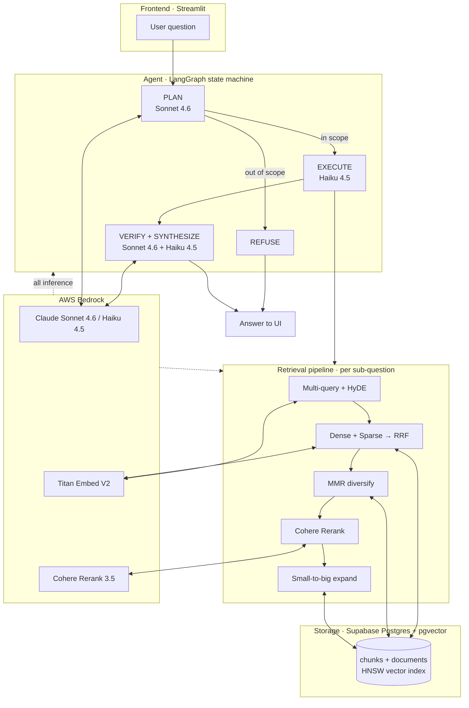
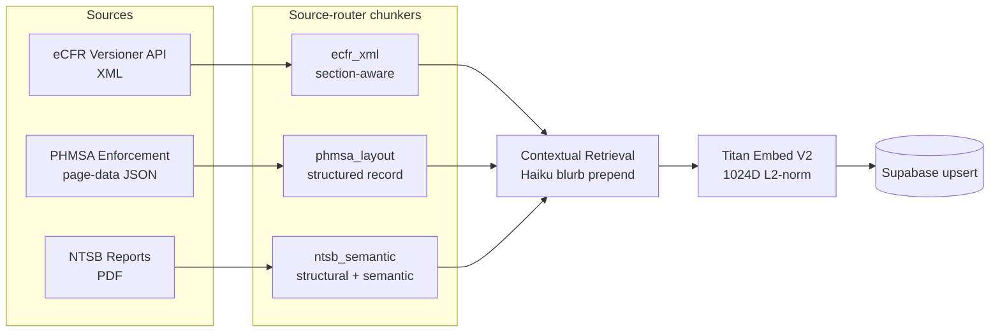
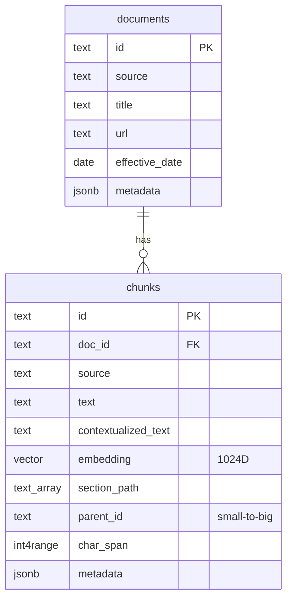
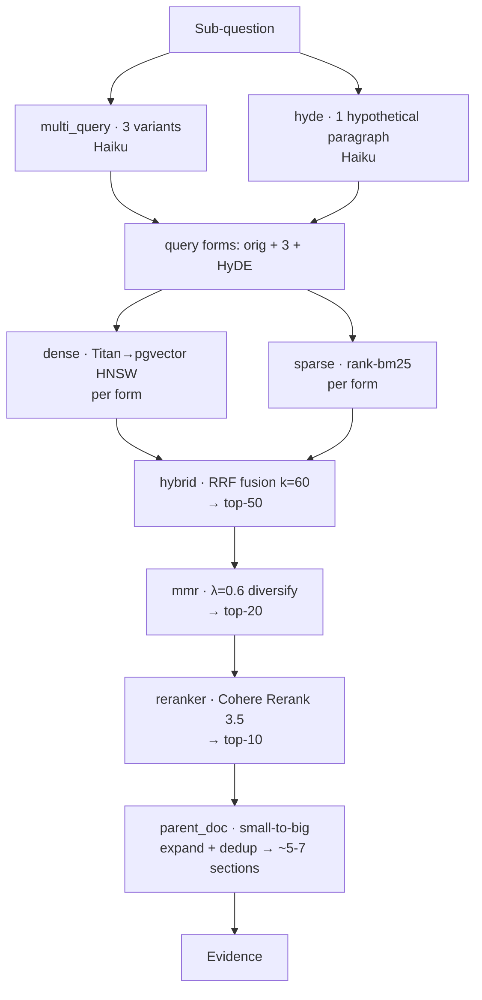
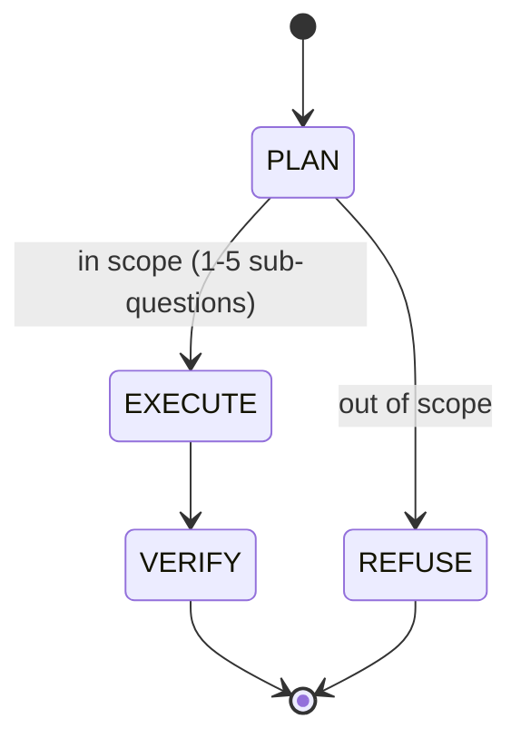
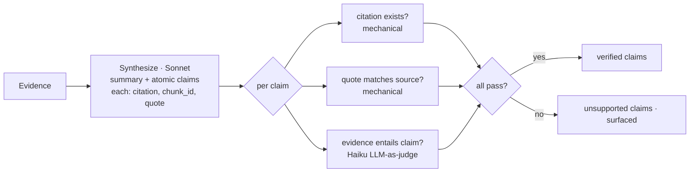

# Gas & Energy Mechanics Copilot v2 — Project Report

**A multi-agent, plan-execute-verify Retrieval-Augmented Generation (RAG) system over US
federal pipeline-safety material.** This report describes every component of the system, the
data and control flow between them, the models and infrastructure used, and the engineering
rationale behind each major decision.

- **Live demo:** https://gas-and-energy-mechanics-copilot.streamlit.app/
- **Interactive system diagram (Miro):** https://miro.com/app/board/uXjVHI06Ju8=/
- **Corpus:** 2,082 chunks / 213 documents — 49 CFR Parts 192/193/195 (859), PHMSA enforcement actions (200), NTSB pipeline accident reports (1,023).
- **Inference:** AWS Bedrock only (Claude Sonnet 4.6, Claude Haiku 4.5, Titan Embed V2, Cohere Rerank 3.5).

---

## 1. Executive summary

The system answers natural-language questions about US pipeline safety by (1) **planning** —
decomposing the question into retrievable sub-questions or refusing if out of scope; (2)
**executing** — running a multi-lane hybrid retrieval pipeline per sub-question; and (3)
**verifying** — synthesizing an answer as atomic claims, each mechanically and semantically
checked against the retrieved evidence, with unsupported claims surfaced rather than hidden.

The corpus is a deliberately small public-domain slice that stands in for proprietary domain
data — **the architecture is the contribution.** Every retrieval and reasoning technique in
the literature that matters for regulated-domain RAG is present and individually defensible.

---

## 2. System architecture (high level)

The system has four layers: **Frontend → Agent → Retrieval → Storage**, with **AWS Bedrock**
as the single inference surface cross-cutting the agent and retrieval layers, and a set of
cross-cutting concerns (config, logging, rate limiting, tracing) underneath all of them.

---

## 3. Ingestion subsystem

Offline pipeline that builds the searchable corpus. Run once via `scripts/build_index.py`.

### 3.1 Source-router chunking (`src/chunking/`)

One chunker is wrong for three structurally different sources, so each source has a
specialist that exploits its native structure, all emitting the **same unified `Chunk`
schema** (`chunking/base.py`).

| Source | Module | Strategy |
|---|---|---|
| eCFR | `ecfr_xml.py` | Walk the XML hierarchy: `DIV6`=subpart, `DIV8 TYPE=SECTION` (with `N=`, `HEAD`, `hierarchy_metadata` citation), `P`=paragraphs. Paragraph units are greedily packed into ~350-token, section-natural chunks; oversize paragraphs recursively split. Each chunk records its full citation path and `parent_id` = section. |
| PHMSA | `phmsa_layout.py` | Synthesize a structured "Respondent / Findings / Order / Civil Penalty" record from the enforcement JSON fields. Cited 49 CFR sections are parsed out of `proposedSubjectEt` (e.g. `[195.452(j)(3)]`) into metadata — the enforcement→regulation join key. |
| NTSB | `ntsb_semantic.py` | Two passes: (1) **structural** — `pdfplumber` text → detect major section headers (Abstract, Executive Summary, Analysis, Conclusions, Probable Cause, Recommendations) and slice; (2) **semantic** — within bounded sections, place chunk boundaries at the 95th-percentile cosine *dips* between adjacent sentence embeddings. Long analysis sections fall back to paragraph packing (a deliberate cost guard). |

**Unified `Chunk` schema** (`chunking/base.py`, mirrors the Supabase row): `chunk_id`
(content hash), `doc_id`, `source`, `text`, `contextualized_text`, `embedding` (1024D),
`section_path`, `parent_id`, `page`, `char_span`, `chunk_index`, `effective_date`, `metadata`.

**Small-to-big:** chunkers emit paragraph-/clause-sized *small* units; siblings share a
`parent_id`, so the full parent section is reconstructed at generation time without storing
parent text twice.

### 3.2 Contextual Retrieval (`chunking/contextual.py`)

For every chunk, Haiku 4.5 writes a 1–2 sentence blurb situating it within its document
(title + section path), prepended to the chunk text **before embedding**. This resolves
pronouns, implicit subjects, and bare citations that a standalone paragraph lacks — the
highest single-shot retrieval lift in the literature (Anthropic, Sep 2024). Failures degrade
gracefully to raw text; `scripts/backfill_context.py` re-contextualizes any that were
throttled during a build (corpus is at 100% coverage).

### 3.3 Embedding (`embedding/bedrock_titan.py`)

Amazon Titan Embed V2 via Bedrock — 1024D, server- and client-side L2-normalized so cosine
== dot product downstream. Retry/backoff via tenacity; concurrency bounded; paced by the
global rate limiter. The embed phase is crash-proof: a chunk that fails to embed is dropped
with a warning rather than aborting a ~90-minute build.

### 3.4 Ingestion modules (`src/ingestion/`)

`ecfr.py`, `phmsa.py`, `ntsb.py` handle source-specific I/O (fetch + parse), each with
per-source failure isolation. `pipeline.py` orchestrates gather → chunk → contextualize →
embed. `scripts/build_index.py` is the CLI entry point (supports source subsets, dump-only,
and no-upsert modes).

---

## 4. Storage subsystem (`infra/supabase_schema.sql`, `src/store.py`)

Supabase Postgres with the **pgvector** extension.

- **HNSW index** (`vector_cosine_ops`, m=16, ef_construction=64) for dense retrieval; GIN
  index on `metadata` for filtered queries.
- **`match_chunks()` RPC** — parameterized cosine kNN with an optional source filter, called
  by the dense retriever.
- **`store.py`** owns connections and batched upserts. Critically, `make_connection()` sets
  **`prepare_threshold=None`** — psycopg3 auto-prepares statements after ~5 identical
  executions, which **breaks under pgbouncer transaction-mode pooling** (Supabase port 6543)
  and silently hangs retrieval. This was a real bug that would have broken the live app.

---

## 5. Retrieval subsystem (`src/retrieval/`)

Runs once per sub-question. Each stage narrows a wide, high-recall candidate set toward a
small, high-precision set of self-contained parent sections.

| Stage | Module | What it does | Why |
|---|---|---|---|
| Multi-query | `multi_query.py` | Haiku rewrites the sub-question into 3 alternate phrasings | Beats vocabulary mismatch (e.g. "pressure test" vs "strength/hydrostatic test") |
| HyDE | `hyde.py` | Haiku drafts one hypothetical regulation paragraph; embed *that* as an extra dense query | A hypothetical answer sits closer to real passages than a terse question |
| Dense | `dense.py` | Titan-embed each query form → `match_chunks` cosine kNN (top-30) | Semantic recall |
| Sparse | `sparse.py` | In-memory `rank-bm25` (top-30); tokenizer keeps citations like `192.619` whole | Exact-term matching dense embeddings blur |
| Fusion | `hybrid.py` | Reciprocal Rank Fusion (k=60) across all ~9 lanes → top-50 | Combines heterogeneous rankings with no score calibration |
| Diversify | `mmr.py` | Maximal Marginal Relevance (λ=0.6) → top-20, using stored embeddings | Stops near-duplicates from crowding the reranker input |
| Rerank | `reranker.py` | Cohere Rerank 3.5 via the Bedrock Rerank API → top-10 (graceful degrade to MMR order) | Cross-encoder precision; on Bedrock → no local-model RAM |
| Expand | `parent_doc.py` | Group reranked hits by `parent_id`, reconstruct each parent section from siblings, dedup → ~5-7 unique sections | Embed small for precision, hand the generator big for context |

`pipeline.py`'s `Retriever` composes all of the above and holds the resident BM25 index + a
pooler-safe DB connection.

---

## 6. Agent subsystem (`src/agents/`)

A 3-node LangGraph state machine with a conditional refusal branch. All structured outputs
are Pydantic (`schemas.py`) — never free-text parsed.

### 6.1 PLAN (`planner.py`, Sonnet 4.6)
Decomposes the query into 1–5 atomic, self-contained sub-questions (splitting comparisons
per-Part), or sets `in_scope=false` with a one-sentence reason. **Visible refusal is the
single most important trust signal in the demo.**

### 6.2 EXECUTE (`executor.py`, Haiku 4.5 orchestration)
Runs the §5 retrieval pipeline per sub-question, then merges and dedups parent sections
across sub-questions so the synthesizer sees each unique section once.

### 6.3 VERIFY + SYNTHESIZE (`verifier.py`, Sonnet 4.6 + Haiku 4.5)

The synthesizer (Sonnet) writes the answer as **atomic claims**, each carrying a citation,
the evidence id it rests on, and a verbatim quote. Each claim is then verified three ways:
(a) the cited evidence exists in what was retrieved; (b) the quoted span actually appears in
the source; (c) Haiku judges whether the evidence entails the claim. Claims failing any gate
go to `unsupported_claims` — **surfaced, never silently dropped.** This is the trust core.

### 6.4 Graph wiring (`graph.py`)
`build_graph()` compiles the state machine; the `Copilot` wrapper binds the retriever, a
correlation id per query, and offers `ask()` (full result) and `stream()` (per-node, for the
streaming UI).

**Model cascade:** Sonnet 4.6 for reasoning (planner, synthesizer); Haiku 4.5 for
orchestration (executor query-gen, per-claim verifier, contextualization). Cost control
without hand-tuning.

---

## 7. Cross-cutting concerns

| Concern | Module | Notes |
|---|---|---|
| Config | `config.py` | `pydantic-settings`; resolved Bedrock model IDs as typed defaults; reads `.env` / Streamlit secrets. |
| Logging | `logging_setup.py` | structlog JSON + per-query correlation IDs. |
| Bedrock clients | `bedrock_clients.py` | Cached boto3 clients honoring profile/keys; **a botocore `before-send` hook paces every Bedrock call** (incl. LangChain + RAGAS). |
| Rate limiting | `ratelimit.py` | Process-global min-interval gate (default 1.2s ≈ <1 req/s) — pacing under the account limit beats fighting throttle with backoff. |
| LLM helpers | `llm.py` | Raw Converse for utility calls; cached `ChatBedrockConverse` for the graph (LangSmith-traced, `with_structured_output`). |
| Observability | `observability/langsmith_setup.py` | Env-gated LangSmith; every node/LLM call traced; no-op when unconfigured. |

> **Operational note:** the demo Bedrock account is rate-limited to ~1 req/s. Builds are a
> ~60–90 min one-time job; queries take ~20–60 s. Reliability work (global limiter, standard
> retries, crash-proof embed, pooler-safe connections) makes both robust at that throughput.

---

## 8. Evaluation subsystem (`src/eval/`, `scripts/run_eval.py`)

Two complementary signals:

1. **Native per-claim verification** (the agent's own audit) — per question: refusal,
   sub-question count, evidence count, verified vs unsupported claim counts. Reliable and
   directly meaningful.
2. **RAGAS** — answer-relevancy and faithfulness (resilient: wrapped so a token-heavy
   faithfulness failure never sinks the report). `generate_testset.py` can synthesize a
   reference set; `hand_curated.py` holds the 10 multi-hop questions.

**Latest run (10 hand-curated multi-hop questions):** 10/10 answered in-scope; planner
decomposed each into 2–5 sub-questions; 10–31 evidence sections retrieved per question;
**native verified-claim rate 50/106 = 0.47** (the rest surfaced as unsupported); **RAGAS
answer-relevancy 0.949**. A moderate verified rate is the point — the verifier is a strict
3-gate audit, not a rubber stamp.

---

## 9. Frontend & deployment

- **Frontend (`app/streamlit_app.py`):** streams the three tiers — 🧭 Plan (collapsible) →
  📚 Evidence (with source links) → ✅ Verified answer with per-claim ✓/⚠ badges. Sidebar
  offers the 6 example queries **and the 10 hand-curated eval questions** as one-click loads.
  Bridges Streamlit secrets → env at startup; caches the `Copilot`.
- **Deployment (`DEPLOY.md`):** Streamlit Community Cloud; state in Supabase; a dedicated
  least-privilege IAM user (`iam/streamlit-bedrock-policy.json`, Bedrock invoke + rerank
  only); lean runtime `requirements.txt` for the 1 GB RAM ceiling; `warm_up_demo.py` for
  cold-start mitigation.

---

## 10. Technology stack

| Layer | Choice |
|---|---|
| Language / deps | Python 3.11+, `uv`, locked `pyproject.toml` |
| LLM inference | AWS Bedrock (`us-east-1`) |
| Planner / Synthesizer | Claude Sonnet 4.6 (`us.anthropic.claude-sonnet-4-6`) |
| Executor / Verifier / Contextualizer | Claude Haiku 4.5 (`us.anthropic.claude-haiku-4-5-20251001-v1:0`) |
| Embeddings | Amazon Titan Embed V2 (1024D) |
| Reranker | Cohere Rerank 3.5 (`cohere.rerank-v3-5:0`) |
| Sparse retrieval | `rank-bm25` (in-memory) |
| Vector DB | Supabase Postgres + pgvector (HNSW) |
| Agent framework | LangGraph |
| Tracing / Eval | LangSmith / RAGAS |
| Config / Logging | pydantic-settings / structlog |
| UI | Streamlit |

---

## 11. Key engineering decisions

1. **Source-router chunking** — exploit each source's structure rather than one-size-fits-all.
2. **Small-to-big** — embed paragraph-sized chunks for precision, expand to parent sections for context, reconstructed from siblings (no duplicate storage).
3. **Reranker on Bedrock (Cohere)** — keeps everything on one inference surface and removes the local cross-encoder RAM cost (fits the 1 GB Streamlit ceiling).
4. **Verification surfaces, never hides** — unsupported claims are shown; a moderate verified rate is honest and is the trust differentiator for a regulated domain.
5. **Conversational memory deliberately omitted** — statelessness keeps every claim traceable to *this* question's evidence; multi-turn would be added via history-aware query reformulation (condense-to-standalone), never by polluting retrieval.
6. **Reliability under a constrained account** — global rate limiting, standard retries, crash-proof builds, and pooler-safe DB connections were required to make a ~1 req/s Bedrock account + free-tier pooler robust.
