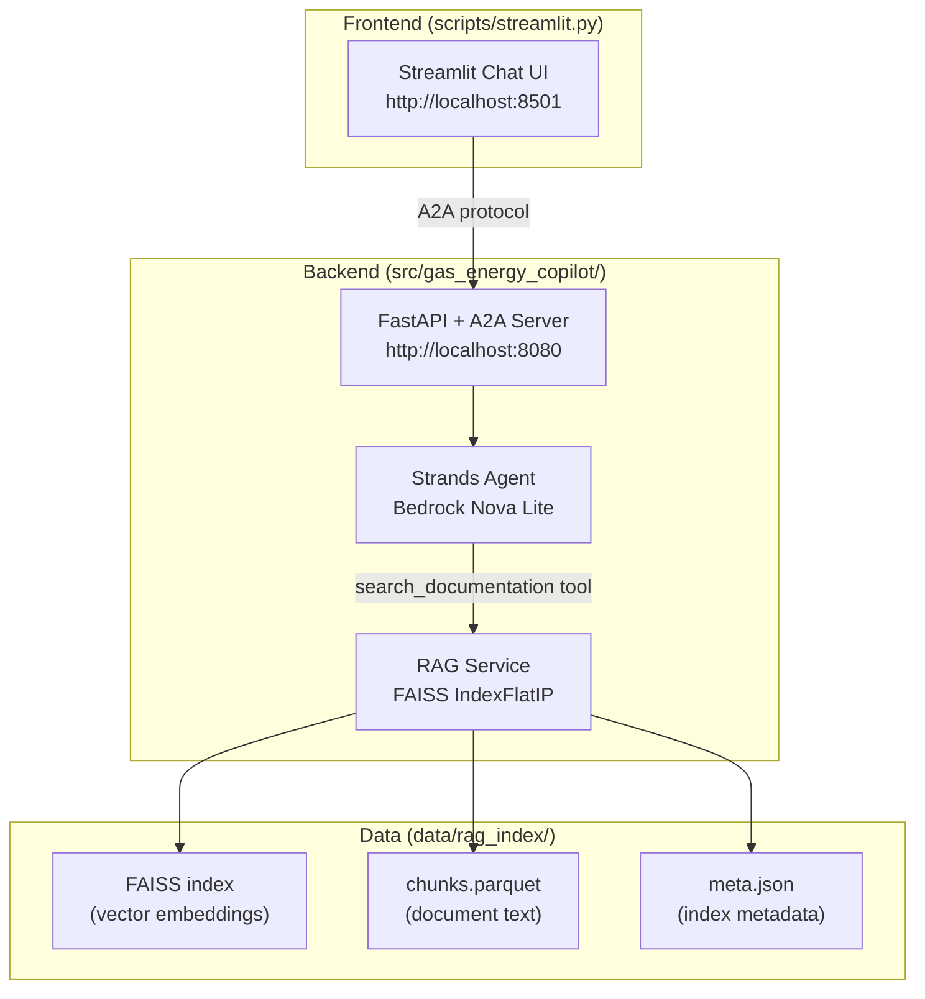

# Gas & Energy Mechanics Copilot

<div align="center">

[](https://www.python.org/)
[](https://fastapi.tiangolo.com/)
[](https://aws.amazon.com/bedrock/)
[](LICENSE)

**RAG-powered AI chatbot for gas & energy engineering documentation.**  
Built on Strands AI Agent SDK, Amazon Bedrock Nova Lite, and FAISS vector search.

</div>

---

## Key Idea

Engineering teams spend hours searching manuals and documentation for answers about engine troubleshooting, configuration parameters, and maintenance procedures. This copilot augments that workflow:

```
User Question
     ↓
Streamlit UI → A2A Server (FastAPI)
                    ↓
             Strands Agent (Bedrock Nova Lite)
                    ↓
             ┌──────┴──────┐
             ↓             ↓
         RAG Service    Bedrock LLM
         (FAISS +       (Nova Lite)
          Bedrock        direct answer
          embeddings)
             ↓
     Top-5 document chunks
             ↓
     Answer with source citations
```

The hypothesis: a domain-specialised RAG index over engineering manuals, combined with a capable LLM, produces more reliable answers than general-purpose search — especially for error codes, configuration parameters, and maintenance sequences.

---

## Architecture



---

## Repository Layout

```
gas-and-energy-mechanics-copilot/
├── src/
│   └── gas_energy_copilot/          # Installable Python package
│       ├── logging.py               # Structured logging setup
│       └── ai_copilot/
│           ├── entrypoint.py        # FastAPI app + uvicorn target
│           ├── api/                 # Health, version, debug endpoints
│           ├── core/                # Config, router, service manager
│           ├── middleware/          # Request/response logging
│           └── services/
│               ├── agent_service.py # Strands agent + tool wiring
│               └── rag_service.py   # FAISS retrieval + Bedrock embeddings
├── config/
│   ├── settings.toml                # Dev config (agent prompt, RAG params)
│   ├── production.settings.toml     # Production overrides
│   └── uvicorn-logging-config.json  # Structured log format
├── data/
│   └── rag_index/                   # FAISS index + document chunks (baked in Docker)
│       ├── index.faiss
│       ├── chunks.parquet
│       └── meta.json
├── scripts/
│   ├── build_index.py               # Build FAISS index from source documents
│   └── streamlit.py                 # Chatbot UI
├── iam/
│   ├── apprunner-service.json        # App Runner service definition
│   └── apprunner-task-role-policy.json
├── tests/
│   └── test_api.py                  # API integration tests
├── Dockerfile                        # Multi-stage build (builder + runtime)
├── pyproject.toml                    # hatchling build, uv deps
├── run_server.sh                     # Local dev server launcher
└── run_chatbot.sh                    # Local Streamlit launcher
```

---

## Installation

Requires Python 3.13+. Uses [uv](https://docs.astral.sh/uv/) for dependency management.

```bash
git clone https://github.com/ashish-code/gas-and-energy-mechanics-copilot.git
cd gas-and-energy-mechanics-copilot

# Using uv (recommended)
uv sync

# Or pip
pip install -e .
```

---

## Quick Start

### Prerequisites

- AWS credentials with Bedrock access (us-west-2 region, Amazon Titan Embeddings + Nova Lite)
- OpenAI API key (for embeddings during index build; Bedrock embeddings used at runtime)

### 1 — Configure credentials

```bash
cp .env_sample .env
# Edit .env: set OPENAI_API_KEY and AWS_PROFILE
```

### 2 — Start the A2A server

```bash
./run_server.sh
```

Starts on `http://localhost:8080`. Loads the RAG index on startup.

### 3 — Launch the chatbot UI

In a new terminal:

```bash
./run_chatbot.sh
```

Opens Streamlit at `http://localhost:8501`.

---

## Configuration

All settings live in `config/settings.toml`:

```toml
[app.agent]
name = "Gas & Energy Mechanics Copilot"
bedrock_model_id = "us.amazon.nova-lite-v1:0"
system_prompt = """
You are a knowledgeable assistant specialising in gas and energy engineering documentation.
Use the search_documentation tool to find relevant information before answering.
"""

[app.rag]
enabled = true
index_dir = "data/rag_index"
top_k = 5
embedding_provider = "bedrock"
embedding_model = "amazon.titan-embed-text-v2:0"
```

---

## Deployment

The application runs on **AWS App Runner** using the provided `Dockerfile`.

```bash
# Build for App Runner (must target linux/amd64 — required for App Runner)
docker build --platform linux/amd64 -t gas-and-energy-mechanics-copilot .

# Push to ECR and deploy via App Runner
# See iam/ directory for required IAM policies
```

> **Note:** Always build with `--platform linux/amd64` when deploying to App Runner from Apple Silicon.

---

## Building the RAG Index

```bash
export OPENAI_API_KEY="your-key"

python scripts/build_index.py \
    --docs-dir /path/to/engineering/manuals \
    --output-dir data/rag_index
```

---

## Testing

```bash
# API integration tests
pytest tests/

# Manual RAG test
python test_rag_retrieval.py
```

---

## References

1. Joshi, A. et al. (2023). *RAG: Retrieval-Augmented Generation for Knowledge-Intensive NLP Tasks.*
2. [Strands Agents SDK](https://strandsagents.com/) — AWS open-source agent framework.
3. [Amazon Bedrock Nova Lite](https://aws.amazon.com/bedrock/) — Serverless LLM inference.
4. [FAISS](https://github.com/facebookresearch/faiss) — Billion-scale similarity search, Facebook AI Research.

---

## License

MIT — see [LICENSE](LICENSE).

---

<div align="center">
  <sub>Built by <a href="https://github.com/ashish-code">Ashish Gupta</a> · Senior Data Scientist</sub>
</div>
