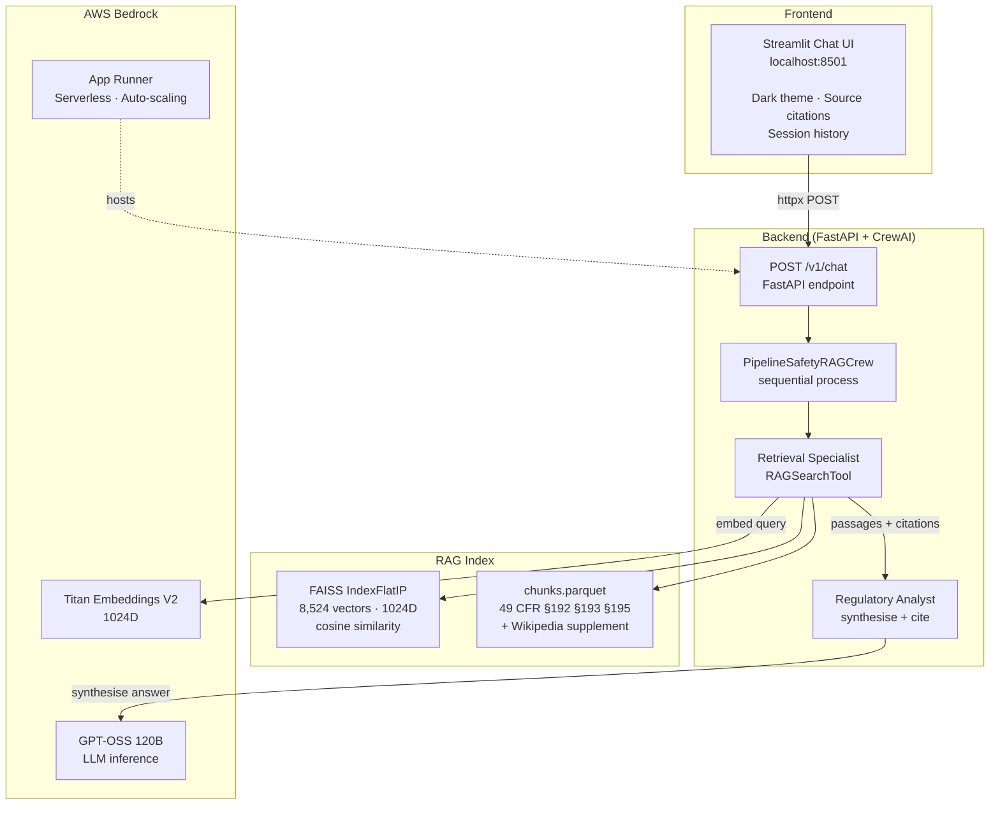
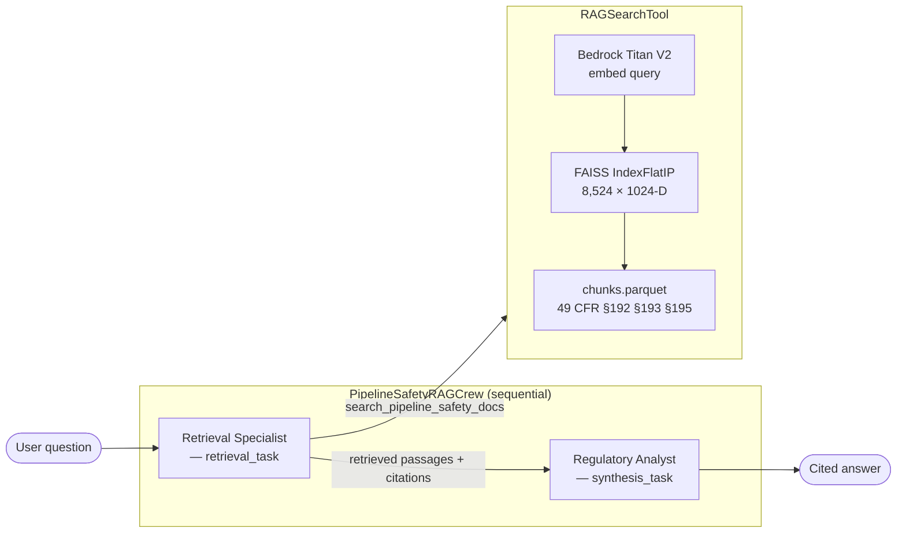
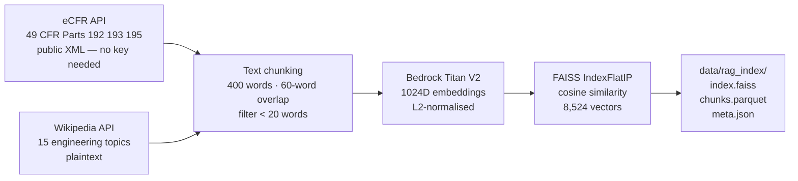

# Gas & Energy Mechanics Copilot

<div align="center">

[](https://www.python.org/)
[](https://fastapi.tiangolo.com/)
[](https://crewai.com/)
[](https://aws.amazon.com/bedrock/)
[](LICENSE)

**Multi-agent RAG copilot for PHMSA pipeline safety regulations.**
Built on CrewAI, Amazon Bedrock GPT-OSS 120B, and FAISS vector search.

</div>

---

## Overview

Regulatory compliance teams and pipeline engineers spend hours parsing dense federal regulations to answer questions about pipeline safety, LNG facility requirements, and hazardous liquid transport rules. This copilot accelerates that workflow:

- **Retrieval-Augmented Generation** over 8,524 document chunks from official PHMSA regulations (49 CFR Parts 192, 193, 195) and a Wikipedia engineering supplement
- **Multi-agent design** — a Retrieval Specialist searches the regulation index, a Regulatory Analyst synthesises a cited answer; each agent has a focused, auditable role
- **REST API** — clean `POST /v1/chat` endpoint served via FastAPI, easy to integrate or extend
- **Streamlit UI** — professional dark-themed chat interface with inline source citations
- **Production deployment** on AWS App Runner via multi-stage Docker + Terraform IaC

```
User question → Streamlit UI ──POST /v1/chat──→ FastAPI
                                                    ↓
                                        PipelineSafetyRAGCrew (CrewAI)
                                                    ↓
                                    ┌───────────────────────────────┐
                                    │  Retrieval Specialist          │
                                    │  search_pipeline_safety_docs  │
                                    │  → FAISS IndexFlatIP          │
                                    │  → Bedrock Titan V2 embed     │
                                    │  → Top-5 regulation chunks    │
                                    └──────────────┬────────────────┘
                                                   ↓ passages + citations
                                    ┌───────────────────────────────┐
                                    │  Regulatory Analyst            │
                                    │  → synthesise cited answer    │
                                    │  → GPT-OSS 120B via Bedrock   │
                                    └──────────────┬────────────────┘
                                                   ↓
                                    Grounded answer with §-cited sources
```

---

## Architecture



---

## Key Capabilities

| Feature | Detail |
|---------|--------|
| **Domain coverage** | 49 CFR Part 192 (gas pipelines), Part 193 (LNG facilities), Part 195 (hazardous liquids) + 15 Wikipedia engineering topics |
| **Index size** | 8,524 chunks · 1,024-dimensional embeddings · FAISS IndexFlatIP |
| **Retrieval latency** | ~150–250 ms per search (embed + FAISS lookup) |
| **Memory footprint** | ~60 MB (50 MB FAISS index + 10 MB chunks DataFrame) |
| **Agent framework** | [CrewAI](https://crewai.com/) — multi-agent sequential crew |
| **LLM** | Amazon Bedrock GPT-OSS 120B (serverless, on-demand pricing) |
| **Embeddings** | Amazon Bedrock Titan Embeddings V2 (1024D, L2-normalised for cosine similarity) |
| **API** | `POST /v1/chat` · FastAPI · synchronous JSON response |
| **Deployment** | AWS App Runner · Docker multi-stage · Terraform IaC |
| **Observability** | structlog JSON logging · request correlation IDs · uvicorn structured logs |

---

## Repository Layout

```
gas-and-energy-mechanics-copilot/
├── src/gas_energy_copilot/
│   ├── logging.py               # Structured logging (JSON for CloudWatch)
│   └── ai_copilot/
│       ├── entrypoint.py        # uvicorn startup + logging config
│       ├── api/
│       │   ├── health.py        # GET /health
│       │   ├── version.py       # GET /version
│       │   └── v1/endpoints/
│       │       └── chat.py      # POST /v1/chat  ← main endpoint
│       ├── core/
│       │   ├── config.py        # Type-safe config (typed-settings + attrs)
│       │   ├── application.py   # FastAPI factory with lifespan
│       │   └── router.py        # Route assembly
│       └── middleware/
│           └── logging.py       # Request/response middleware (correlation IDs)
│
├── crew/                        # CrewAI package (standalone CLI + FastAPI dep)
│   └── src/pipeline_safety_rag_crew/
│       ├── crew.py              # PipelineSafetyRAGCrew — 2-agent sequential crew
│       ├── main.py              # CLI: uv run run_crew --question "..."
│       ├── config/
│       │   ├── agents.yaml      # retrieval_specialist + regulatory_analyst
│       │   └── tasks.yaml       # retrieval_task + synthesis_task
│       └── tools/
│           └── rag_tool.py      # RAGSearchTool — FAISS + Bedrock Titan V2
│
├── config/
│   ├── settings.toml            # Dev defaults (RAG params, CORS, port)
│   ├── production.settings.toml # Production overrides (JSON logs, debug=false)
│   └── uvicorn-logging-config.json
│
├── data/rag_index/              # Baked into Docker image
│   ├── index.faiss              # 8,524 vectors × 1024D, IndexFlatIP
│   ├── chunks.parquet           # Text + metadata (path, filename, page, chunk_id)
│   └── meta.json                # Embedding model, dimensions, source documents
│
├── scripts/
│   ├── build_index.py           # Fetch eCFR + Wikipedia → chunk → embed → FAISS
│   └── streamlit.py             # Streamlit chatbot UI (dark theme)
│
├── iam/                         # IAM policies for App Runner Bedrock access
├── terraform/                   # ECR, IAM, App Runner (main.tf, variables.tf)
├── tests/
│   ├── test_api.py
│   ├── test_bedrock_auth.py     # AWS credential verification
│   └── test_chatbot_e2e.py      # E2E: POST /v1/chat with real Bedrock call
│
├── Dockerfile                   # Multi-stage: builder (uv + deps) + runtime (lean)
├── pyproject.toml               # hatchling build, uv deps, mypy + ruff config
├── justfile                     # Task runner: dev, chat, push, deploy, teardown
├── run_server.sh                # Dev server launcher
└── run_chatbot.sh               # Streamlit launcher
```

---

## Quick Start

### Prerequisites

- Python 3.13+, [uv](https://docs.astral.sh/uv/)
- AWS credentials with Bedrock access (`us-east-1`, models: GPT-OSS 120B + Titan Embeddings V2)

```bash
git clone https://github.com/ashish-code/gas-and-energy-mechanics-copilot.git
cd gas-and-energy-mechanics-copilot
uv sync
```

### 1 — Configure credentials

```bash
cp .env_sample .env
# Set AWS_PROFILE (or AWS_ACCESS_KEY_ID / AWS_SECRET_ACCESS_KEY)
# MODEL is pre-set to bedrock/openai.gpt-oss-120b-1:0
```

### 2 — Start the backend server

```bash
./run_server.sh
# or: just dev
```

FastAPI starts on `http://localhost:8080`. The crew loads the FAISS index on the first request.

### 3 — Launch the Streamlit UI

```bash
./run_chatbot.sh
# or: just chat
```

Opens `http://localhost:8501`. The sidebar shows connection status; click **Test Connection** to verify the backend.

**Sample questions:**
- *"What are the pressure testing requirements under 49 CFR §192.505?"*
- *"Summarise the cathodic protection requirements for buried pipelines."*
- *"What design standards apply to LNG facilities under Part 193?"*
- *"When is an operations and maintenance plan required under §195.402?"*

### 4 — CLI (standalone, no server needed)

The crew can also be run directly from the command line:

```bash
cd crew
uv sync
uv run run_crew --question "What cathodic protection standards apply under §192.461?"
# Output saved to crew/output/answer.md
```

---

## REST API

### `POST /v1/chat`

Ask a pipeline safety question. The two-agent crew retrieves relevant regulation passages and synthesises a cited answer.

**Request:**
```json
{ "question": "What are the pressure testing requirements under §192.505?" }
```

**Response:**
```json
{
  "answer": "Under 49 CFR §192.505, steel pipelines operating at ..."
}
```

**Other endpoints:**

| Method | Path | Description |
|--------|------|-------------|
| `GET` | `/health` | Liveness check |
| `GET` | `/version` | App version |
| `GET` | `/docs` | Swagger UI (dev mode) |

---

## Multi-Agent Design

The `PipelineSafetyRAGCrew` runs two agents sequentially:



| Agent | Role | Tools |
|-------|------|-------|
| **Retrieval Specialist** | Issues one or more targeted searches; collects top-5 passages per search; reformulates queries if initial results are sparse | `RAGSearchTool` |
| **Regulatory Analyst** | Synthesises retrieved passages into a clear, §-cited answer (300–500 words); flags gaps in retrieved coverage | — |

---

## Configuration

`config/settings.toml` controls all runtime behaviour:

```toml
[app]
app_name = "Gas & Energy Mechanics Copilot"
port = 8080
environment = "development"
debug = true

[app.rag]
enabled = true
index_dir = "data/rag_index"
top_k = 5
embedding_model = "amazon.titan-embed-text-v2:0"
embedding_region = "us-east-1"
similarity_threshold = 0.0    # Raise to filter low-confidence results

[app.logging]
log_level = "INFO"
log_json = false              # true in production (CloudWatch-compatible)
```

The LLM used by the crew is controlled by the `MODEL` environment variable (see `.env_sample`):

```bash
MODEL=bedrock/openai.gpt-oss-120b-1:0   # default
```

---

## Building the RAG Index

The index builder fetches public regulatory data automatically — no proprietary documents or API keys required.

```bash
uv run python scripts/build_index.py
# or: just build-index
```



| Stage | Detail |
|-------|--------|
| Source fetch | eCFR Versioner API (public, no API key) + Wikipedia plaintext API |
| Chunking | 400 words/chunk, 60-word overlap, minimum 20 words per chunk |
| Embedding | Bedrock Titan Embeddings V2 · 1024D · rate-limited |
| Index | FAISS `IndexFlatIP` · inner product on L2-normalised vectors = cosine similarity |
| Output | `index.faiss` + `chunks.parquet` (PyArrow Parquet) + `meta.json` |

---

## Deployment

### Docker

```bash
# Always target linux/amd64 — App Runner does not support arm64
docker build --platform linux/amd64 -t gas-and-energy-mechanics-copilot .
docker run -p 8080:8080 --env-file .env gas-and-energy-mechanics-copilot
```

### AWS App Runner via Terraform

```bash
just bootstrap   # First-time: tf init → ECR → push image → create App Runner service
just push        # Build + push new image to ECR
just redeploy    # push + trigger App Runner deployment
just teardown    # Delete App Runner service (keep ECR + IAM — pauses cost)
just deploy      # Restore App Runner from existing ECR image
just destroy-all # Full teardown including ECR and IAM
```

The Terraform stack creates:
- **ECR repository** — versioned Docker image storage
- **IAM task role** — least-privilege Bedrock `InvokeModel` + `InvokeModelWithResponseStream`
- **App Runner service** — serverless container with auto-scaling

> **Note:** Docker images built on Apple Silicon (`arm64`) fail on App Runner with `exec format error`. Always build with `--platform linux/amd64`.

---

## Dependencies

| Library | Role |
|---------|------|
| `fastapi[standard]` | Async REST API framework |
| `crewai[tools]` | Multi-agent orchestration (sequential crew, tool calling) |
| `boto3` | AWS SDK — Bedrock LLM inference and embeddings |
| `faiss-cpu` | Billion-scale similarity search (Facebook AI Research) |
| `pandas` + `pyarrow` | Document chunk storage and retrieval (Parquet) |
| `typed-settings` | Type-safe TOML configuration (attrs-based dataclasses) |
| `structlog` | Structured JSON logging with correlation IDs |
| `streamlit` | Chat UI with dark theme and source citations |
| `uvicorn[standard]` | ASGI server |

---

## Testing

```bash
just test api                                        # API integration tests
uv run mypy src/                                     # Type checking
uv run ruff check src/                               # Linting
uv run pytest tests/test_bedrock_auth.py -v          # Verify AWS Bedrock credentials
uv run pytest tests/test_chatbot_e2e.py -v -s        # E2E: calls real Bedrock (slow)
```

---

## Roadmap

- [ ] **Query planner agent** — decomposes multi-part questions into sub-queries before retrieval
- [ ] **Fact-checking agent** — verifies analyst's claims against the retrieved source passages
- [ ] **CrewAI Memory** — persist conversation context across requests
- [ ] **Hierarchical process** — manager agent routes questions to domain-specific sub-crews
- [ ] **Streaming responses** — Server-Sent Events from crew task events

---

## References

1. Lewis, P. et al. (2020). [*Retrieval-Augmented Generation for Knowledge-Intensive NLP Tasks.*](https://arxiv.org/abs/2005.11401) NeurIPS.
2. [CrewAI](https://crewai.com/) — Multi-agent AI framework.
3. [Amazon Bedrock](https://aws.amazon.com/bedrock/) — Serverless LLM inference.
4. [FAISS](https://github.com/facebookresearch/faiss) — Billion-scale similarity search, Facebook AI Research.
5. [eCFR Title 49](https://www.ecfr.gov/current/title-49) — Electronic Code of Federal Regulations, PHMSA pipeline safety.

---

## License

MIT — see [LICENSE](LICENSE).

---

<div align="center">
  <sub>Built by <a href="https://github.com/ashish-code">Ashish Gupta</a> · Senior Data Scientist</sub>
</div>
