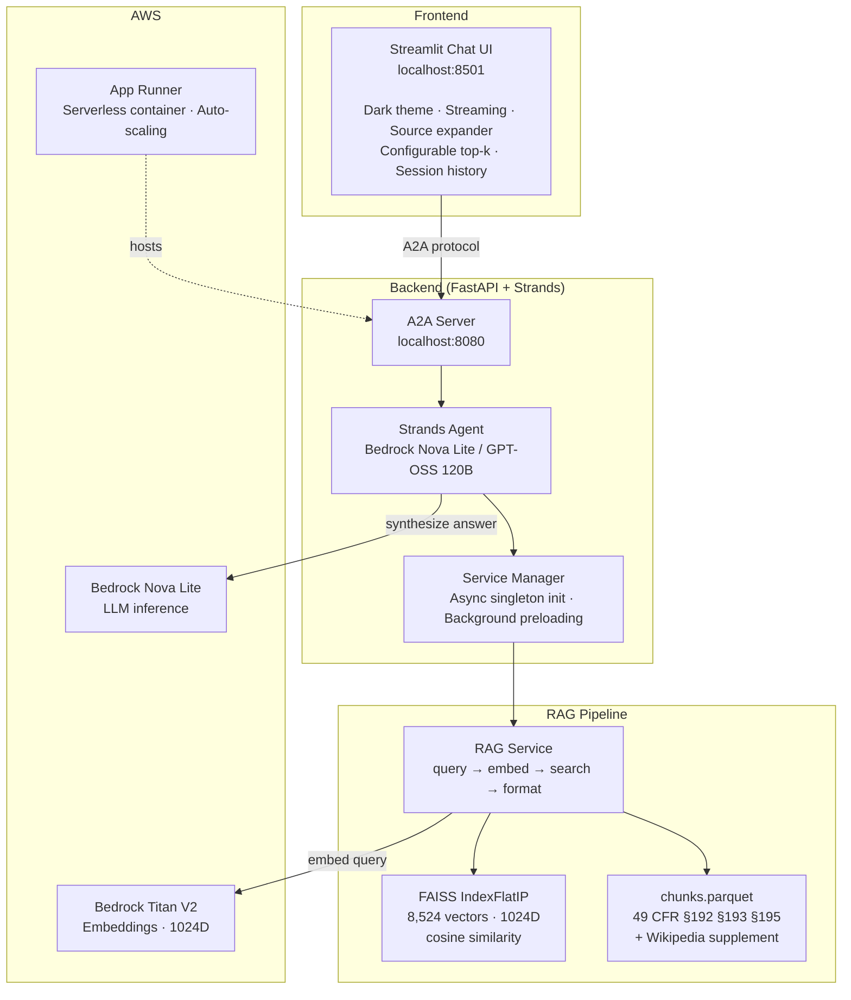
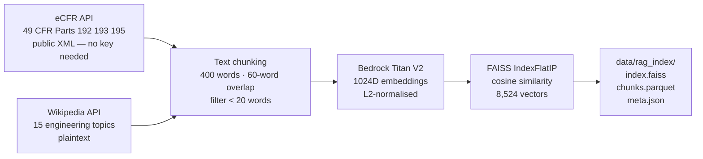

# Gas & Energy Mechanics Copilot

<div align="center">

[](https://www.python.org/)
[](https://fastapi.tiangolo.com/)
[](https://aws.amazon.com/bedrock/)
[](https://strandsagents.com/)
[](LICENSE)

**RAG-powered agentic chatbot for PHMSA pipeline safety regulations.**
Built on Strands Agent SDK, Amazon Bedrock Nova Lite, and FAISS vector search.

</div>

---

## Overview

Regulatory compliance teams and pipeline engineers spend hours parsing dense federal regulations to answer questions about pipeline safety, LNG facility requirements, and hazardous liquid transport rules. This copilot accelerates that workflow:

- **Retrieval-Augmented Generation** over 8,524 document chunks from official PHMSA regulations (49 CFR Parts 192, 193, 195) and a Wikipedia engineering supplement
- **Agentic design** — the AI agent autonomously decides when to search documentation vs. answer from context
- **Streaming responses** with inline source citations (filename, section, similarity score)
- **Production deployment** on AWS App Runner via multi-stage Docker + Terraform IaC

```
User question → Streamlit UI → A2A server (FastAPI)
                                     ↓
                          Strands Agent (Bedrock Nova Lite)
                                     ↓ tool call
                          search_documentation()
                                     ↓
                     FAISS IndexFlatIP  ←  Bedrock Titan Embeddings V2
                     (8,524 × 1024D)
                                     ↓
                     Top-5 regulation chunks + similarity scores
                                     ↓
                     Grounded answer with §-cited sources
```

---

## Architecture



---

## Key Capabilities

| Feature | Detail |
|---------|--------|
| **Domain coverage** | 49 CFR Part 192 (gas pipelines), Part 193 (LNG facilities), Part 195 (hazardous liquids) + 15 Wikipedia engineering topics |
| **Index size** | 8,524 chunks · 1,024-dimensional embeddings · FAISS IndexFlatIP |
| **Retrieval latency** | ~150–250 ms end-to-end (embed + FAISS search) |
| **Memory footprint** | ~60 MB (50 MB FAISS index + 10 MB chunks DataFrame) |
| **Agent framework** | [Strands Agents SDK](https://strandsagents.com/) (AWS open-source) |
| **LLM** | Amazon Bedrock Nova Lite / GPT-OSS 120B (serverless, on-demand pricing) |
| **Embeddings** | Amazon Bedrock Titan Embeddings V2 (1024D, L2-normalised for cosine similarity) |
| **Deployment** | AWS App Runner · Docker multi-stage · Terraform IaC |
| **Observability** | structlog JSON logging · request correlation IDs · uvicorn structured logs |

---

## Repository Layout

```
gas-and-energy-mechanics-copilot/
├── src/gas_energy_copilot/
│   ├── logging.py               # Structured logging (JSON for CloudWatch)
│   └── ai_copilot/
│       ├── entrypoint.py        # uvicorn startup + logging config
│       ├── api/                 # Health, version, debug endpoints
│       ├── core/
│       │   ├── config.py        # Type-safe config (typed-settings + attrs)
│       │   ├── application.py   # FastAPI factory with lifespan
│       │   ├── router.py        # Route assembly
│       │   └── service_manager.py  # Async singleton init, background preloading
│       ├── middleware/
│       │   └── logging.py       # Request/response middleware (correlation IDs)
│       └── services/
│           ├── rag_service.py   # FAISS retrieval + Bedrock Titan embeddings
│           └── agent_service.py # Strands agent + search_documentation tool
│
├── config/
│   ├── settings.toml            # Dev defaults (agent prompt, RAG params, port)
│   ├── production.settings.toml # Production overrides (JSON logs, debug=false)
│   └── uvicorn-logging-config.json
│
├── data/rag_index/              # Baked into Docker image
│   ├── index.faiss              # 8,524 vectors × 1024D, IndexFlatIP
│   ├── chunks.parquet           # Text + metadata (path, filename, page, chunk_id)
│   └── meta.json                # Embedding model, dimensions, source documents
│
├── scripts/
│   ├── build_index.py           # Fetch eCFR + Wikipedia → chunk → embed → FAISS
│   └── streamlit.py             # Streamlit chatbot UI (dark theme, streaming)
│
├── iam/                         # IAM policies for App Runner Bedrock access
├── terraform/                   # ECR, IAM, App Runner (main.tf, variables.tf)
├── tests/
│   ├── test_api.py
│   └── test_bedrock_auth.py     # AWS credential verification
│
├── Dockerfile                   # Multi-stage: builder (uv + deps) + runtime (lean)
├── pyproject.toml               # hatchling build, uv deps, mypy + ruff config
├── justfile                     # Task runner: dev, chat, push, deploy, teardown
├── run_server.sh                # Dev server launcher
└── run_chatbot.sh               # Streamlit launcher
```

---

## Quick Start

### Prerequisites

- Python 3.13+, [uv](https://docs.astral.sh/uv/)
- AWS credentials with Bedrock access (`us-east-1`, models: Nova Lite + Titan Embeddings V2)

```bash
git clone https://github.com/ashish-code/gas-and-energy-mechanics-copilot.git
cd gas-and-energy-mechanics-copilot
uv sync
```

### 1 — Configure credentials

```bash
cp .env_sample .env
# Set AWS_PROFILE (or AWS_ACCESS_KEY_ID / AWS_SECRET_ACCESS_KEY)
```

### 2 — Start the A2A backend server

```bash
./run_server.sh
# or: just dev
```

FastAPI starts on `http://localhost:8080`. The RAG index loads in the background on startup (~150 ms).

### 3 — Launch the Streamlit UI

```bash
./run_chatbot.sh
# or: just chat
```

Opens `http://localhost:8501`. Enter the server URL in the sidebar and start asking questions.

**Sample questions:**
- *"What are the pressure testing requirements under 49 CFR §192.505?"*
- *"Summarise the cathodic protection requirements for buried pipelines."*
- *"What design standards apply to LNG facilities under Part 193?"*
- *"When is an operations and maintenance plan required under §195.402?"*

---

## Configuration

`config/settings.toml` controls all runtime behaviour:

```toml
[app]
app_name = "Gas & Energy Mechanics Copilot"
port = 8080
environment = "development"
debug = true

[app.agent]
name = "AI Copilot"
bedrock_model_id = "us.amazon.nova-lite-v1:0"   # or openai.gpt-oss-120b-1:0
system_prompt = """
You are a knowledgeable assistant specialised in PHMSA pipeline safety regulations.
ALWAYS use the search_documentation tool first to retrieve relevant regulatory text.
Base your answer on retrieved documents and cite sources (filename, §section, page).
"""

[app.rag]
enabled = true
index_dir = "data/rag_index"
top_k = 5                                          # Chunks per query (Streamlit slider: 1–10)
embedding_model = "amazon.titan-embed-text-v2:0"
embedding_region = "us-east-1"
similarity_threshold = 0.0                         # Raise to filter low-confidence results

[app.logging]
log_level = "INFO"
log_json = false   # true in production (CloudWatch-compatible)
```

---

## Building the RAG Index

The index builder fetches public regulatory data automatically — no proprietary documents required.

```bash
uv run python scripts/build_index.py
# or: just build-index
```



| Stage | Detail |
|-------|--------|
| Source fetch | eCFR Versioner API (public, no API key) + Wikipedia plaintext API |
| Chunking | 400 words/chunk, 60-word overlap, minimum 20 words per chunk |
| Embedding | Bedrock Titan Embeddings V2 · 1024D · rate-limited |
| Index | FAISS `IndexFlatIP` · inner product on L2-normalised vectors = cosine similarity |
| Output | `index.faiss` + `chunks.parquet` (PyArrow Parquet) + `meta.json` |

---

## Agent Tool

The Strands agent exposes one tool: `search_documentation`. The agent calls it autonomously when it determines regulatory context is needed.

```python
@tool
def search_documentation(query: str) -> str:
    """Search the PHMSA regulatory documentation index."""
    chunks = rag_service.retrieve(query, top_k=settings.rag.top_k)
    return rag_service.format_context(chunks)
```

Retrieved context includes filename, page number, and cosine similarity score for each chunk, enabling the LLM to produce cited answers grounded in the source regulations.

---

## Deployment

### Docker

```bash
# Always target linux/amd64 — App Runner does not support arm64
docker build --platform linux/amd64 -t gas-and-energy-mechanics-copilot .
docker run -p 8080:8080 --env-file .env gas-and-energy-mechanics-copilot
```

### AWS App Runner via Terraform

```bash
just bootstrap   # First-time: tf init → ECR → push image → create App Runner service
just push        # Build + push new image to ECR
just redeploy    # push + trigger App Runner deployment
just teardown    # Delete App Runner service only (keep ECR + IAM — pauses cost)
just deploy      # Restore App Runner from existing ECR image
just destroy-all # Full teardown including ECR and IAM
```

The Terraform stack creates:
- **ECR repository** — versioned Docker image storage
- **IAM task role** — least-privilege Bedrock `InvokeModel` + `InvokeModelWithResponseStream`
- **App Runner service** — serverless container with auto-scaling

> **Note:** Docker images built on Apple Silicon (`arm64`) fail on App Runner with `exec format error`. Always build with `--platform linux/amd64`.

---

## Dependencies

| Library | Role |
|---------|------|
| `fastapi[standard]` | Async REST API framework |
| `strands-agents[a2a]` | Agentic AI framework (Strands SDK) + A2A protocol |
| `boto3` | AWS SDK — Bedrock LLM inference and embeddings |
| `faiss-cpu` | Billion-scale similarity search (Facebook AI Research) |
| `pandas` + `pyarrow` | Document chunk storage and retrieval (Parquet) |
| `typed-settings` | Type-safe TOML configuration (attrs-based dataclasses) |
| `structlog` | Structured JSON logging with correlation IDs |
| `streamlit` | Chat UI with streaming responses and dark theme |
| `uvicorn[standard]` | ASGI server |

---

## Testing

```bash
just test api           # API integration tests (pytest + coverage)
uv run mypy src/        # Type checking
uv run ruff check src/  # Linting
uv run pytest tests/test_bedrock_auth.py -v  # Verify AWS Bedrock credentials
```

---

## References

1. Lewis, P. et al. (2020). [*Retrieval-Augmented Generation for Knowledge-Intensive NLP Tasks.*](https://arxiv.org/abs/2005.11401) NeurIPS.
2. [Strands Agents SDK](https://strandsagents.com/) — AWS open-source agent framework.
3. [Amazon Bedrock Nova Lite](https://aws.amazon.com/bedrock/) — Serverless LLM inference.
4. [FAISS](https://github.com/facebookresearch/faiss) — Billion-scale similarity search, Facebook AI Research.
5. [eCFR Title 49](https://www.ecfr.gov/current/title-49) — Electronic Code of Federal Regulations, PHMSA pipeline safety.

---

## License

MIT — see [LICENSE](LICENSE).

---

<div align="center">
  <sub>Built by <a href="https://github.com/ashish-code">Ashish Gupta</a> · Senior Data Scientist · BrightAI</sub>
</div>
