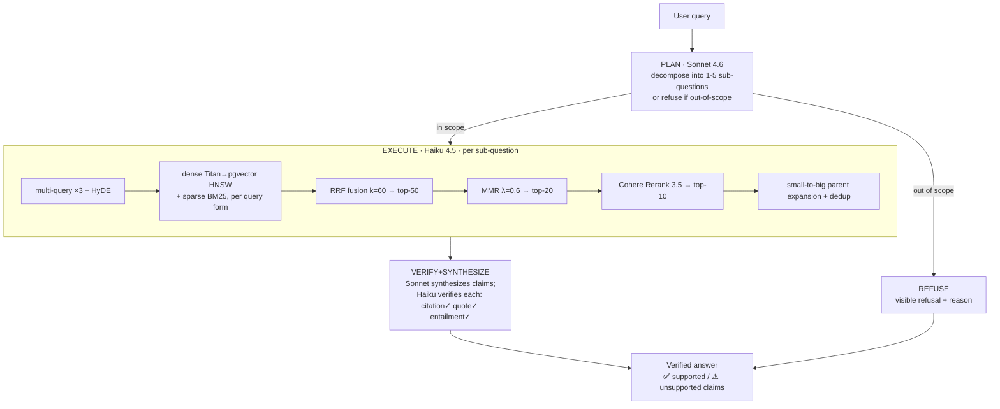

# Gas & Energy Mechanics Copilot — v2

**Multi-agent RAG system over US federal pipeline-safety regulations, enforcement actions, and accident investigations. Built as a research-engineering showcase of plan-execute-verify agentic retrieval.**

> Production discipline applied to research-grade retrieval techniques, over a small public-domain corpus that stands in for proprietary domain data.

## Live demo

🔗 _Streamlit Community Cloud URL — added at deploy (M7)._

First query is slow (~30–60 s): warm-up + this Bedrock account runs at ~1 req/s. Run `scripts/warm_up_demo.py` ~5 min before a live session.

## Demo design philosophy

The corpus is a **deliberately small, public-domain slice** (~1.5–2K chunks): selected 49 CFR subparts, ~200 recent PHMSA enforcement actions, and 10 NTSB pipeline accident reports. In a real deployment the corpus would be proprietary domain data that can't be shared publicly — **the architecture is the contribution; the corpus is a stand-in.** ~2K chunks is more than enough to exercise every technique below. **Variety over volume:** three structurally different sources force a real source-router design and enable genuine cross-source (enforcement ↔ regulation ↔ accident) reasoning.

## What's new in v2 (vs v1)

v1 was a single-tool Strands agent over a FAISS index of Wikipedia text with fixed-size word chunking. v2 is a ground-up rewrite:

- **Plan → execute → verify** multi-agent graph (LangGraph) replacing single-shot tool RAG.
- **Source-router chunking** — three specialized chunkers (eCFR XML walker, PHMSA layout, NTSB structural+semantic) under one schema.
- **Contextual Retrieval** (Anthropic) — LLM context blurb prepended pre-embedding.
- **Hybrid retrieval** — dense (Titan V2 + pgvector HNSW) + sparse (BM25) fused with **RRF**.
- **Multi-query expansion + HyDE** query-side augmentation.
- **MMR diversification** → **Cohere Rerank 3.5** (cross-encoder, on Bedrock).
- **Small-to-big** parent-section expansion.
- **Per-claim verification** — mechanical (citation/quote) + LLM-as-judge entailment; unsupported claims surfaced, not dropped.
- **Cascade routing** (Sonnet for reasoning, Haiku for orchestration), **structured Pydantic I/O**, **LangSmith tracing**, **RAGAS eval**, Supabase/pgvector, `pydantic-settings`, structlog JSON.

## Architecture


```mermaid
flowchart TD
    Q[User query] --> P[PLAN · Sonnet 4.6<br/>decompose into 1-5 sub-questions<br/>or refuse if out-of-scope]
    P -->|in scope| E
    P -->|out of scope| R[REFUSE<br/>visible refusal + reason]
    subgraph E [EXECUTE · Haiku 4.5 · per sub-question]
      MQ[multi-query ×3 + HyDE] --> RET[dense Titan→pgvector HNSW<br/>+ sparse BM25, per query form]
      RET --> RRF[RRF fusion k=60 → top-50]
      RRF --> MMR[MMR λ=0.6 → top-20]
      MMR --> RR[Cohere Rerank 3.5 → top-10]
      RR --> PE[small-to-big parent expansion + dedup]
    end
    E --> V[VERIFY+SYNTHESIZE<br/>Sonnet synthesizes claims;<br/>Haiku verifies each: citation✓ quote✓ entailment✓]
    V --> A[Verified answer<br/>✅ supported / ⚠️ unsupported claims]
    R --> A
```

Each chunk is a paragraph-sized **small** unit sharing a `parent_id` with its siblings; at generation time the parent section is reconstructed from siblings (small-to-big) — no duplicate parent storage.

## Stack

| Layer | Choice |
|---|---|
| Language / deps | Python 3.11+, `uv`, `pyproject.toml` (locked) |
| Config / logging | `pydantic-settings`, `structlog` JSON + correlation IDs |
| LLM inference | AWS Bedrock, `us-east-1` |
| Planner / Synthesizer | Claude **Sonnet 4.6** (`us.anthropic.claude-sonnet-4-6`) |
| Executor / Verifier / Contextualizer | Claude **Haiku 4.5** (`us.anthropic.claude-haiku-4-5-20251001-v1:0`) |
| Embeddings | Amazon **Titan Embed V2** (1024D, L2-normalized) |
| Reranker | **Cohere Rerank 3.5** via Bedrock (`cohere.rerank-v3-5:0`) |
| Sparse | `rank-bm25` (in-memory) |
| Vector DB | Supabase Postgres + **pgvector** (HNSW) |
| Agent framework | **LangGraph** (3-node state machine) |
| Tracing / Eval | **LangSmith** · **RAGAS** |
| UI | **Streamlit** |

> Note: Claude 4.x on Bedrock is **inference-profile only** — code uses the `us.*` cross-region inference-profile IDs. Cohere Rerank 3.5 is available in `us-east-1`, so the documented `bge-reranker-base` fallback is not built.

## Quick start

```bash
# 1. Install (runtime + ingestion + eval + dev groups)
uv sync

# 2. Configure
cp .env.example .env          # set AWS_PROFILE (local) and SUPABASE_DB_URL
#  Supabase: create a project, run infra/supabase_schema.sql in the SQL editor,
#  then paste the Transaction pooler URI (port 6543) into SUPABASE_DB_URL.

# 3. Build the index (fetch → chunk → contextualize → embed → upsert)
#    One-time; ~60–90 min on a ~1 req/s Bedrock account (embeddings persist).
uv run python scripts/build_index.py

# 4. Run the demo
uv run streamlit run app/streamlit_app.py

# 5. (optional) Evaluate
uv run python scripts/generate_golden_set.py --size 20   # RAGAS test set
uv run python scripts/run_eval.py                        # -> eval_report.md
```

Tests: `uv run pytest` (offline subset runs without AWS/DB).

**Deploy:** see [`DEPLOY.md`](DEPLOY.md) for the Streamlit Community Cloud steps + the dedicated least-privilege IAM user (`iam/streamlit-bedrock-policy.json`).

## Eval results

Two complementary signals: RAGAS metrics (`scripts/run_eval.py` → `eval_report.md`) and the
agent's **own** per-claim verification (a native, audited faithfulness measure).

Run over all 10 hand-curated multi-hop questions (`eval_report.md`, defaults, no tuning):

| signal | value | notes |
|---|---|---|
| Questions answered in-scope | **10 / 10** | planner decomposed each into 2–5 sub-questions |
| Evidence retrieved | 10–31 parent sections / question | 9-lane fusion → rerank → small-to-big |
| Native verified-claim rate | **50 / 106 = 0.47** | the other 56 claims surfaced as `unsupported`, not dropped |
| RAGAS answer-relevancy | **0.949** | clean single-question run |

The agent's verifier is itself a strict faithfulness gate — each claim must pass **three**
checks: the citation exists in retrieved evidence, the quoted span matches the source
verbatim, and a Haiku LLM-as-judge confirms the evidence entails the claim. ~Half the
synthesized claims clear all three; the rest are **surfaced** as `unsupported_claims`. A
moderate verified-rate is the point: the verifier is a real audit, not a rubber stamp, and
the system never presents an ungrounded claim as fact. This — **visible decomposition +
visible per-claim verification** — is the trust signal the demo is built around, not a high
pass rate.

> Eval throughput note: full RAGAS metrics over the 10/40-question sets run sequentially
> against this ~1 req/s Bedrock account, so the complete sweep is a long one-time job
> (`scripts/run_eval.py`). `faithfulness` via RAGAS is token-heavy and can truncate on very
> detailed answers; the native verifier above is the primary grounding measure.

The 10 hand-curated questions (`src/eval/hand_curated.py`) are multi-hop by design — they
require planner decomposition and exercise the trace tree.

## Research grounding

| Technique | Source |
|---|---|
| Contextual Retrieval | Anthropic, "Introducing Contextual Retrieval" (Sep 2024) |
| Hybrid + Reciprocal Rank Fusion | Cormack et al., "Reciprocal Rank Fusion" (SIGIR 2009) |
| HyDE | Gao et al., "Precise Zero-Shot Dense Retrieval without Relevance Labels" (2022) |
| Multi-query expansion | Standard query-expansion / RAG-Fusion practice |
| MMR diversification | Carbonell & Goldstein, "The Use of MMR…" (SIGIR 1998) |
| Cross-encoder reranking | Nogueira & Cho, "Passage Re-ranking with BERT" (2019); Cohere Rerank 3.5 |
| Small-to-big / parent-document | LlamaIndex/LangChain parent-document retrieval pattern |
| Plan-execute & LLM-as-judge | ReAct/Plan-and-Solve lineage; Zheng et al., "Judging LLM-as-a-Judge" (2023) |
| Evaluation | Es et al., "RAGAS: Automated Evaluation of RAG" (2023) |

## Future work

- Knowledge-graph layer for explicit cross-reference traversal (CFR ↔ enforcement ↔ accident).
- ColPali for scanned/figure-heavy NTSB pages.
- Fine-tuned domain embeddings; more aggressive reasoning-model cascade.
- Multi-tenancy and per-source access control for proprietary corpora.

---

_Built with [Claude Code](https://claude.com/claude-code). See `PLAN.md` for the milestone-by-milestone build log and design decisions._
