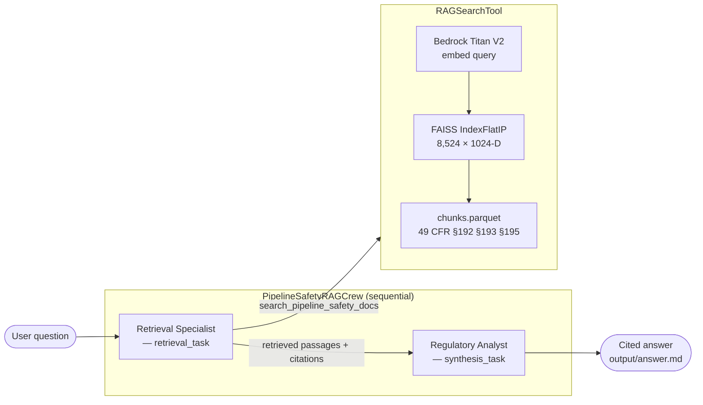

# Pipeline Safety RAG Crew

> **Feature branch: `feature/multi-agent`**
> Multi-agent CrewAI implementation of the gas & energy pipeline safety copilot.
> The existing Strands-based FastAPI app is untouched in this branch.

---

## Architecture

Two-agent sequential crew backed by the **same FAISS index** and
**Bedrock Titan V2 embeddings** used by the main copilot application.
The LLM is **GPT-OSS 120B via Amazon Bedrock** — same model as the Strands copilot.



| Agent | Responsibility | Tools |
|-------|---------------|-------|
| **Retrieval Specialist** | Issues targeted searches; collects top-5 passages | `RAGSearchTool` |
| **Regulatory Analyst** | Synthesises passages into a clear cited answer | — |

---

## Quick start

> **Run from the `crew/` directory** so the default `RAG_INDEX_DIR=../data/rag_index`
> resolves to the index already in this repository.

```bash
cd crew

# Install (uv recommended)
uv sync

# Configure
cp .env.example .env      # AWS_PROFILE is usually the only thing to change

# Ask the default question (§192.505 pressure testing)
uv run run_crew

# Custom question
uv run run_crew --question "What cathodic protection standards apply under §192.461?"
```

Output is printed to stdout and saved to `crew/output/answer.md`.

---

## Configuration

All settings are environment variables (set in `crew/.env`):

| Variable | Default | Description |
|----------|---------|-------------|
| `MODEL` | `bedrock/openai.gpt-oss-120b-1:0` | LLM for both agents |
| `RAG_INDEX_DIR` | `../data/rag_index` | Path to FAISS index (relative to `crew/`) |
| `BEDROCK_EMBEDDING_MODEL` | `amazon.titan-embed-text-v2:0` | Titan V2 embedding model |
| `BEDROCK_EMBEDDING_REGION` | `us-east-1` | AWS region |
| `RAG_TOP_K` | `5` | Chunks retrieved per search |
| `AWS_PROFILE` | `default` | AWS credentials profile |

---

## Relationship to the main app

| | Main app (`src/`) | This crew (`crew/`) |
|--|-------------------|--------------------|
| Framework | Strands Agent SDK | CrewAI |
| Agents | 1 | 2 |
| Serving | FastAPI + A2A server + Streamlit | CLI / scriptable |
| LLM | `openai.gpt-oss-120b-1:0` via Strands | Same model via `bedrock/` prefix |
| RAG stack | `data/rag_index/` (FAISS + Titan V2) | Same index, same embeddings |

The crew is additive — it lives alongside the existing application and shares
the pre-built FAISS index without any changes to the main codebase.

---

## Planned additions (iterative)

- [ ] **Query planner agent** — decomposes multi-part questions into sub-queries before retrieval
- [ ] **Fact-checking agent** — verifies analyst's claims against the retrieved source text
- [ ] **CrewAI Memory** — persist conversation context across runs
- [ ] **Hierarchical process** — manager agent routes questions to domain-specific sub-crews
- [ ] **Streamlit wrapper** — chat UI over the crew (parallel to the existing Strands UI)
